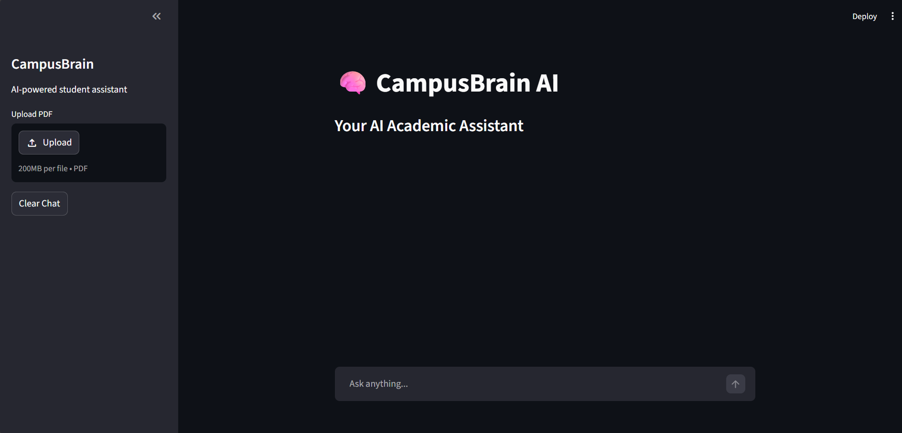
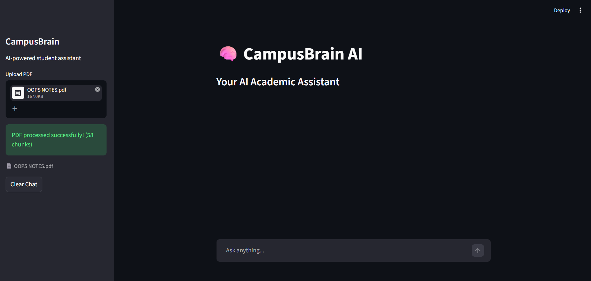
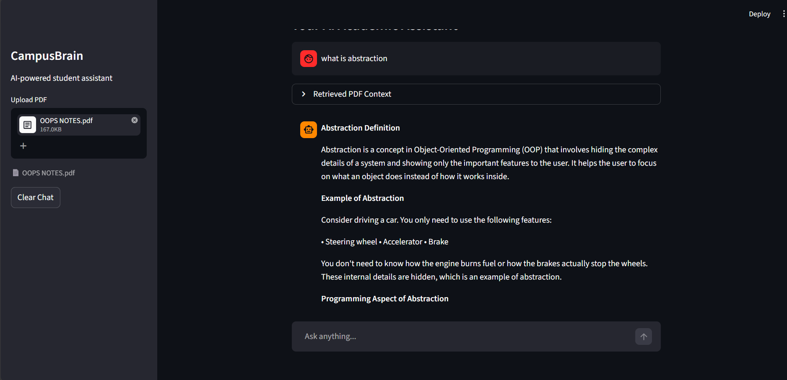

# 🧠 CampusBrain AI

An AI-powered academic assistant designed for students.

CampusBrain AI helps students learn concepts, solve doubts, and improve productivity using modern AI technologies like Large Language Models (LLMs), LangChain, and Retrieval-Augmented Generation (RAG).

This project is being developed as a complete AI agent ecosystem focused on education, productivity, and placement preparation.

---

# 🚀 Features

## ✅ Current Features

- AI-powered chatbot
- Llama 3.1 integration via Groq
- Interactive Streamlit interface
- LangChain-based architecture
- Real-time AI responses
- Environment variable security using `.env`
- Conversational memory system
- Context-aware AI conversations
- Session-based chat persistence
- ChatGPT-style chat interface
- Stateful conversational architecture

## ✅ RAG Features

- PDF upload support
- PDF text extraction pipeline
- Manual semantic chunking
- Overlapping chunk generation
- Embedding generation using Sentence Transformers
- ChromaDB vector database integration
- Semantic similarity search
- Retrieval-Augmented Generation (RAG)
- Context-aware PDF question answering
- Unified AI + PDF assistant interface
- Vector-based semantic retrieval
- Persistent session-based chat history
- PDF-aware conversational assistant
- Modular AI application architecture
- Context inspection through retrieval viewer
- Intelligent fallback to general AI knowledge
- PDF processing status indicators
- Streamlit-based interactive workflow
---

# 🧠 AI Architecture

CampusBrain AI currently uses a modular Retrieval-Augmented Generation (RAG) architecture.

The system combines:
- Conversational AI
- Semantic search
- Vector embeddings
- Context-aware retrieval
- PDF-based knowledge augmentation

## Current Architecture Flow

User Question
↓
Query Embedding Generation
↓
Semantic Search in ChromaDB
↓
Relevant PDF Chunk Retrieval
↓
Context Augmentation
↓
Groq LLM Inference
↓
AI Response Generation
↓
Session Memory Update
↓
Chat UI Re-rendering

## RAG Processing Pipeline

PDF Upload
↓
Text Extraction
↓
Chunk Generation
↓
Embedding Generation
↓
ChromaDB Vector Storage
↓
User Question
↓
Query Embedding
↓
Semantic Retrieval
↓
Context Augmentation
↓
Groq LLM Response Generation

# 🛠️ Tech Stack

| Technology | Purpose |
|---|---|
| Python | Core backend language |
| Streamlit | Frontend user interface |
| LangChain | AI application framework |
| LangChain Message Objects | Conversational memory handling |
| Groq | High-speed LLM inference |
| Llama 3.1 | Large Language Model |
| Git & GitHub | Version control |
| ChromaDB | Vector database |
| Sentence Transformers | Embedding generation |
| RAG Pipeline | Context-aware retrieval |


---

# 📂 Project Structure
```plaintext
CampusBrain/
│
├── app.py
├── requirements.txt
├── README.md
├── .gitignore
├── .env
│
├── modules/
│   ├── __init__.py
│   ├── chat_assistant.py
│   └── pdf_processor.py
│
├── chroma_db/
├── uploaded_pdfs/
├── data/
│
├── screenshots/
│
└── venv/
```

# ⚙️ Installation

## 1. Clone Repository

```bash
git clone YOUR_REPOSITORY_LINK
```

---

## 2. Move Into Project Directory

```bash
cd CampusBrain
```

---

## 3. Create Virtual Environment

```bash
python -m venv venv
```

---

## 4. Activate Virtual Environment

### Windows

```bash
venv\Scripts\activate
```

---

## 5. Install Dependencies

```bash
pip install -r requirements.txt
```

---

# 🔑 Environment Variables

Create a `.env` file in the project root directory.

```env
GROQ_API_KEY=your_api_key_here
```

---

# ▶️ Run the Application

```bash
streamlit run app.py
```

---
# 📸 Application Preview

### Main Chat Interface


### PDF Upload Workflow


### PDF Question Answering


# 🎯 Project Goals

CampusBrain AI aims to evolve into a complete AI student ecosystem with features such as:


- PDF-based learning assistant
- RAG pipeline
- AI study planner
- Placement preparation assistant
- Coding mentor
- Personalized learning support
- Deployment on Hugging Face Spaces

## Current Achievements

- Built a complete Retrieval-Augmented Generation (RAG) pipeline
- Integrated semantic search using vector embeddings
- Developed a modular AI application architecture
- Implemented PDF-based knowledge retrieval
- Created a unified conversational AI experience

---

# 📌 Development Roadmap

## Phase 1
- Basic AI chatbot
- Groq + Llama 3 integration
- Streamlit interface

## Phase 2
- Conversational memory system
- Stateful chat architecture
- Session-based memory handling
- Context-aware conversations
- Chat-style UI using Streamlit

## Phase 3
- PDF upload system
- PDF text extraction
- Manual chunking pipeline
- Overlap-based chunking
- Embedding generation
- ChromaDB vector storage
- Semantic retrieval pipeline
- Retrieval-Augmented Generation (RAG)
- Unified AI + PDF assistant

## Phase 4 (In Progress)

- Deployment preparation
- Persistent vector database integration
- Retrieval quality improvements
- Prompt engineering optimization
- Improved user experience


## Upcoming Phases

- Persistent vector database
- Multi-PDF support
- Advanced retrieval optimization
- AI productivity tools
- Placement preparation assistant
- Deployment on Hugging Face Spaces
- Streaming AI responses
- Metadata-aware retrieval
- Resume Analyzer
- AI Interview Preparation Assistant
- Study Planner
- YouTube Learning Assistant
- Personalized Student Dashboard
- PostgreSQL Integration
- User Authentication
- Multi-Agent CampusBrain Ecosystem
---

# 🔒 Security

Sensitive files are excluded using `.gitignore`:
- `.env`
- `venv/`
- `__pycache__/`
- `chroma_db/`

---

# 🌐 Deployment

Deployment targets:

- Hugging Face Spaces
- Streamlit Community Cloud

Status:
- Local Development: ✅ Complete
- Deployment: 🔄 In Progress

# 👨‍💻 Author

**Basavaraj N S**  
AIML Student | AI Enthusiast | Building AI Systems

---

# 📊 Current Project Status

| Component | Status |
|------------|---------|
| Chat Assistant | ✅ Complete |
| Groq Integration | ✅ Complete |
| Conversational Memory | ✅ Complete |
| PDF Upload System | ✅ Complete |
| Text Extraction | ✅ Complete |
| Chunking Pipeline | ✅ Complete |
| Embedding Generation | ✅ Complete |
| ChromaDB Integration | ✅ Complete |
| Semantic Retrieval | ✅ Complete |
| RAG Pipeline | ✅ Complete |
| Deployment | 🔄 In Progress |

# ⭐ Future Vision

CampusBrain AI is being developed as a modern AI agent capable of helping students with:
- academics
- AI/ML learning
- productivity
- placement preparation
- personalized educational assistance

The long-term goal is to build a deployable AI platform for student success.